## Web Engineering Project 2018 by Fabian Witschi

#### Table of Contents
- [Project Manager: Description](#project-manager-description)
- [Functionalities: Brief Description](#functionalities-brief-description)
    - [Register](#register)
    - [Login](#login)
    - [Project Overview](#project-overview)
    - [Create Project](#create-project)
    - [Profile](#profile)
- [Use Cases](#use-cases)
    - [UC-1 Register/Login](#uc-1-register-and-login)
    - [UC-2 Project Overview](#uc-2-project-overview)
    - [UC-3 Create Project](#uc-3-create-project)
    - [UC-4 Profile](#uc-4-profile)
    - [UC-5 Modify Project](#uc-5-modify-project)
- [Entity Relationship Diagram (ERD)](#entity-relationship-diagram-erd)
    - [Table: authtoken](#table-authtoken)
    - [Table: user](#table-user)
    - [Table: project](#table-project)
- [Wireframe Diagrams](#wireframe-diagrams)
    - [Initial Page](#initial-page)
    - [Project Overview Page](#project-overview-page)
    - [Sign Up Page](#sign-up-page)
    - [Create Project Page](#create-project-page)
    - [Profile Page](#profile-page)
    - [Modify Project Page](#modify-project-page)
- [Heroku Link](#heroku-link)
 
 

#### Project Manager: Description
The web-application Project Manager is a small tool that allows private or business users to
store and manage their own projects. They have the ability to create or modify/delete a project 
(properties include: Project Name, Project Owner, Project Description, Project Employees (who is
working on the project, Project Starting Date, Project Duration (number in weeks)). Moreover, the
projects are listed in the "home" page including the respective properties. The user may view all
or a specifically selected project as a pdf and print it as needed.
 
 

#### Functionalities: Brief Description
##### _Register_
Enter your information to create a user account that is stored in the database
 
 

##### _Login_
Log in the page if you have a create your account - forgot your password? No worries, press the link
below and reset your password with a link sent via email (attention: email only works when connected
to a remote server)
 
 

##### _Project Overview_
View all projects that you have created on one page with the properties inclusive. In addition
you can modify them or view them as a pdf.
 
 
##### _Create Project_
You are able to create your own project by setting the properties. Set a project owner, a project
name, a project description, the names of the employees working on the project, a starting date, and
the planned time (numbers in weeks) to spend on the project.
 
 

##### _Profile_
Just update or delete your account as you wish.
 
 

#### Use Cases
The web application has the following five use case scenarios: Register/Login, Project Overview, 
Create Project, Profile, Modify Project.
 
 

##### _UC-1 Register and Login_
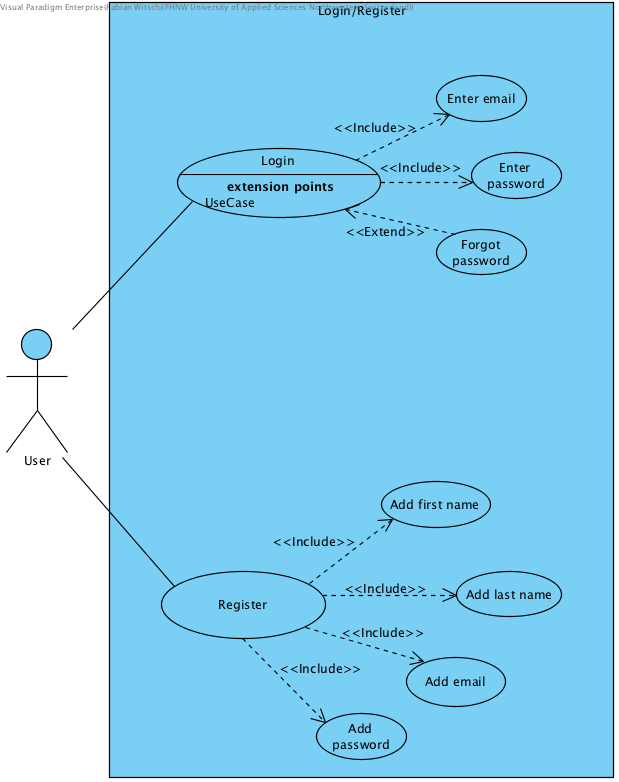
 
 

##### _UC-2 Project Overview_
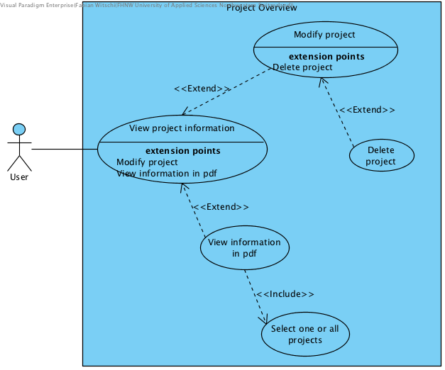
 
 

##### _UC-3 Create Project_
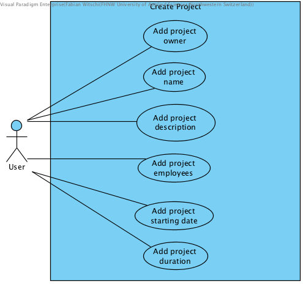
 
 

##### _UC-4 Profile_
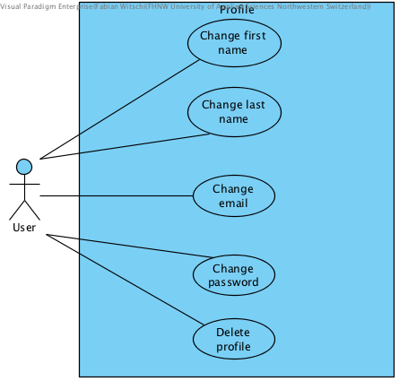
 
 

##### _UC-5 Modify Project_
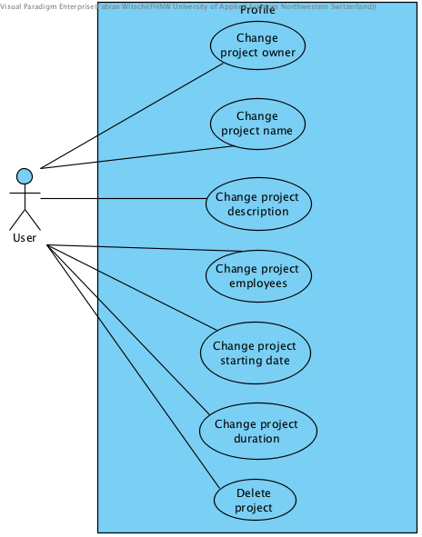
 
 

#### Entity Relationship Diagram (ERD)
See below the ERD for the web application. Note: The table "authtoken" has no function yet but has
been created in order to support further extension of the application in terms of security.

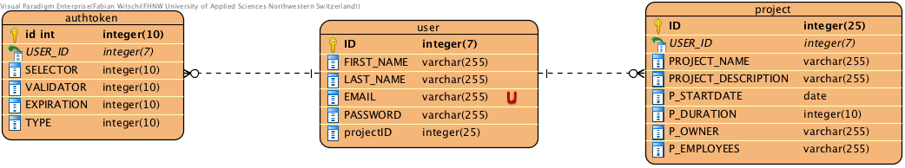
 

From this diagram the following SQL queries can be derived:
 
 

##### _Table: authtoken_
CREATE TABLE `authtoken` ( 
  `ID` int(11) unsigned NOT NULL AUTO_INCREMENT, 
  `USER_ID` int(7) unsigned NOT NULL, 
  `SELECTOR` varchar(255) NOT NULL DEFAULT '', 
  `VALIDATOR` varchar(255) NOT NULL DEFAULT '', 
  `EXPIRATION` timestamp NOT NULL DEFAULT CURRENT_TIMESTAMP ON UPDATE CURRENT_TIMESTAMP, 
  `TYPE` int(10) NOT NULL, 
  PRIMARY KEY (`ID`), 
  KEY `fk_userID_authtoken` (`USER_ID`), 
  CONSTRAINT `fk_userID_authtoken` FOREIGN KEY (`USER_ID`) REFERENCES `user` (`ID`) 
  ON DELETE CASCADE ON UPDATE NO ACTION
) 
 

##### _Table: user_
CREATE TABLE `user` ( 
  `ID` int(7) unsigned NOT NULL AUTO_INCREMENT, 
  `FIRST_NAME` varchar(255) NOT NULL DEFAULT '', 
  `LAST_NAME` varchar(255) NOT NULL DEFAULT '', 
  `EMAIL` varchar(255) NOT NULL DEFAULT '', 
  `PASSWORD` varchar(255) NOT NULL DEFAULT '', 
  PRIMARY KEY (`ID`), 
  UNIQUE KEY `EMAIL` (`EMAIL`)
) 
 

##### _Table: project_
CREATE TABLE `project` ( 
  `ID` int(25) unsigned NOT NULL AUTO_INCREMENT, 
  `USER_ID` int(7) unsigned NOT NULL, 
  `PROJECT_NAME` varchar(255) NOT NULL DEFAULT '', 
  `PROJECT_DESCRIPTION` text NOT NULL, 
  `P_STARTDATE` date NOT NULL, 
  `P_DURATION` varchar(255) NOT NULL DEFAULT '', 
  `P_OWNER` varchar(255) NOT NULL DEFAULT '', 
  `P_EMPLOYEES` text NOT NULL, 
  PRIMARY KEY (`ID`), 
  KEY `fk_userID_project` (`USER_ID`), 
  CONSTRAINT `fk_userID_project` FOREIGN KEY (`USER_ID`) REFERENCES `user` (`ID`) 
  ON DELETE CASCADE ON UPDATE NO ACTION
) 

#### Wireframe Diagrams
This section contains a few wireframe diagrams that demonstrate how the user interface looks (rough
estimation) and how they are connected to one antoher; in other words, what page is connected to
the another one. Note: Only pages that have valuable functions have been drawn into diagrams.
 

##### _Initial Page_
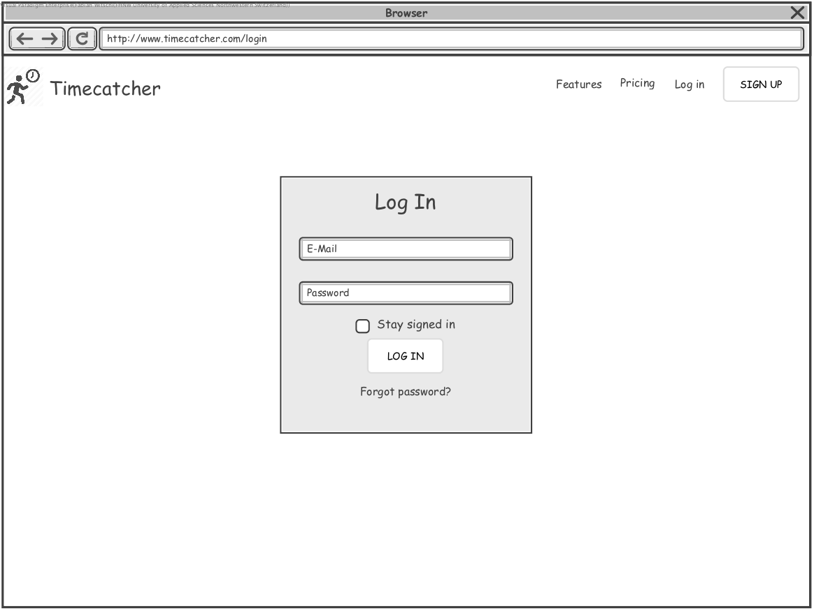
 
From this page, if you log in, you get to the project overview page - if you will have to register
you may get to the sign up page.
 
 

##### _Project Overview Page_
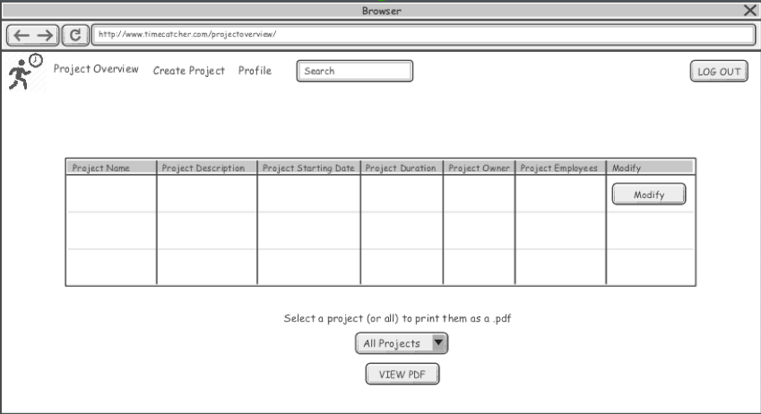
 
Here you can get to "Create Project", "Profile", "Modify a particular project", or "view a project
as a pdf". Finally, you also could log out to get back to the login interface.
 
 

##### _Sign Up Page_
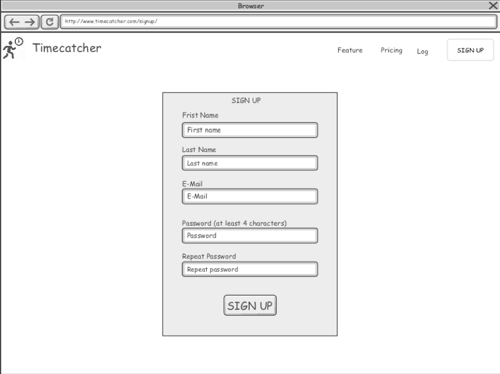
 
If signing up, you will be directed to the project overview page - if your entries are correct.
 
 

##### _Create Project Page_
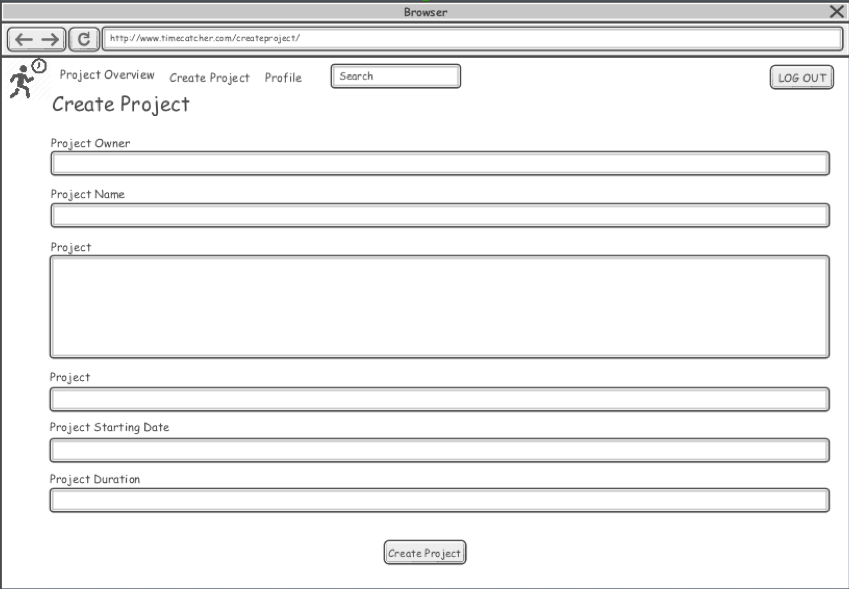
 
If creating a new project after setting all the required properties, you will be directed to the
project overview page - the new project will be listed there.
 
 

##### _Profile Page_
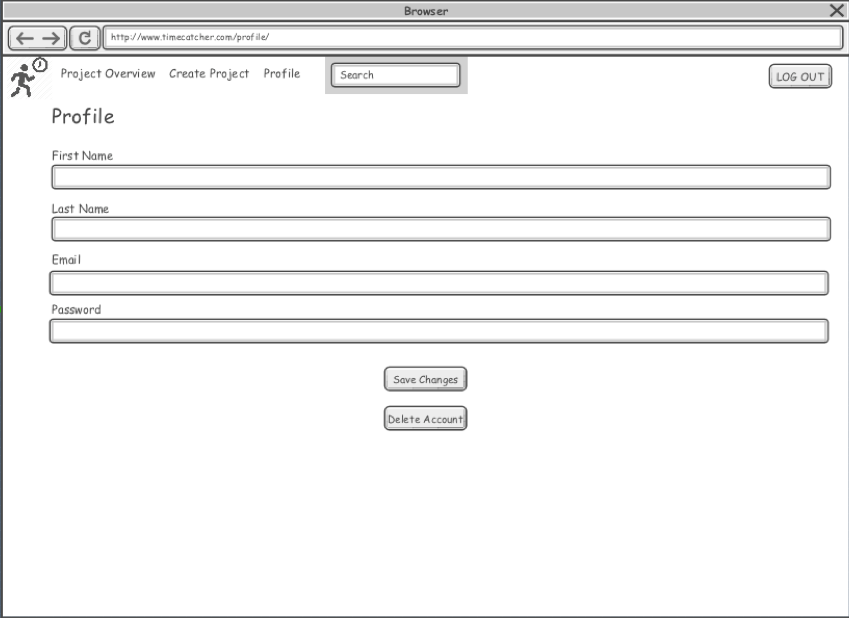
 
From the profile page you get either to the project overview (if changing any field and pressed
change properties) or you get back to the login field if pressing "delete account".
 
 

##### _Modify Project Page_
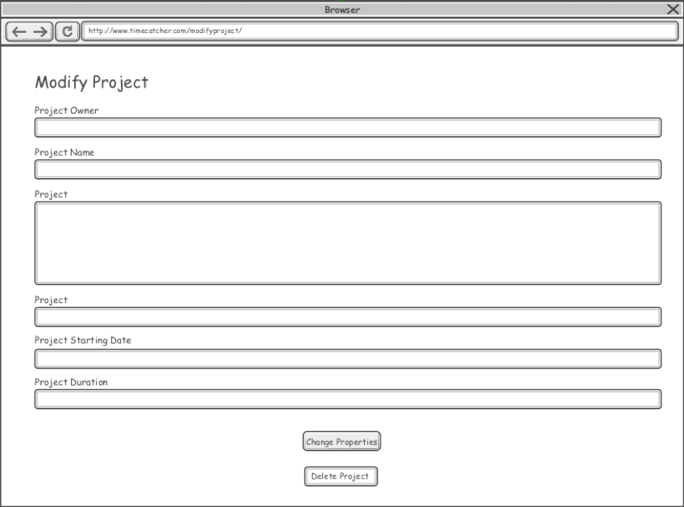
 
In both cases - changing properties, deleting project - you will be directed to the project overview
where the updated list of your projects will be listed.
 
 

#### Heroku Link
Please find below the link to the deployed Heroku application and play a4round:
 
https://we-projectmanager.herokuapp.com/
 
 
HAVE FUN PLAYING WITH THE APP.